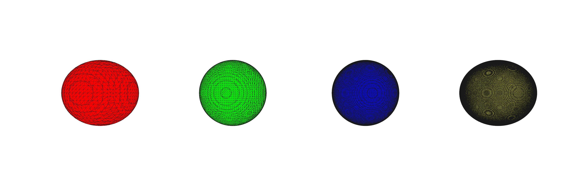
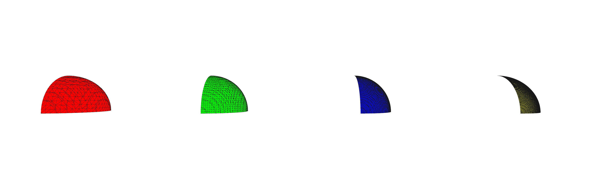
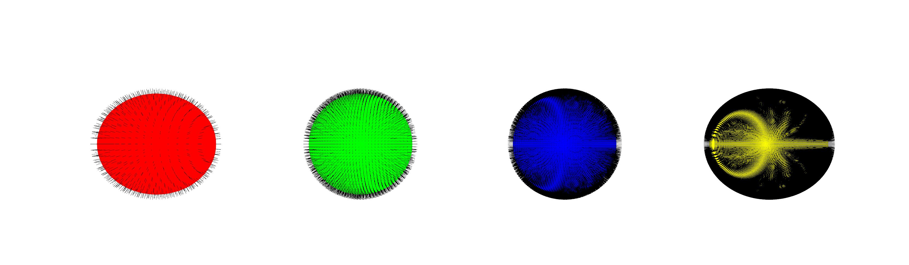

# CUDA Marching Cubes — GPU-Accelerated Iso-Surface Extraction for PyTorch

A fast CUDA implementation of the Marching Cubes algorithm for extracting iso-surfaces from volumetric grids, built as a PyTorch extension. Designed for real-time 3D reconstruction pipelines, with native support for TSDF grids and per-cell observation masks.

## Features

- **Full GPU pipeline**: parallel counting, allocation, and generation of triangles
- **Mask support**: per-cell boolean mask to avoid unwanted triangles
- **PyTorch-native**: inputs and outputs are CUDA tensors, no CPU round-trips  
- Compiled JIT with `-O3 --use_fast_math` for maximum throughput  
  - Retrives also **vertex normals** if `compute_normals=True` (requires 3D grid access, so slightly slower)

## Requirements

- Python 3.8+  
- PyTorch with CUDA support  
- CUDA toolkit (compatible with your PyTorch build)  

## Usage

```python
import torch
from mc_mixin import _load_mc_ext

mc_cuda = _load_mc_ext()  # JIT-compiles on first call

# --- Basic: extract iso-surface from a TSDF grid ---
grid = torch.zeros(128, 128, 128, device="cuda", dtype=torch.float32)
# ... fill grid with signed distance values ...
verts, faces = mc_cuda.marching_cubes(grid, thresh=0.0)

# verts: [V, 3] float32 — positions in grid-index space
# faces: [F, 3] int32  — triangle indices, CCW winding


# --- With mask: ignore unobserved voxels ---
mask = torch.ones(128, 128, 128, device="cuda", dtype=torch.bool)
mask[:64, :64, :] = False   # unobserved slice / spicchio

verts, faces, normals = mc_cuda.marching_cubes(grid, thresh=0.0, mask=mask, compute_normals=True)
```

| Description | Image |
|-------------|-------|
| Different Resolutions Support |  |
| Masking Support  |  |
| Normals Computation Support |  |

## API

```
marching_cubes(grid, thresh, mask=None) -> (verts, faces)
```

| Parameter | Type | Description |
|-----------|------|-------------|
| `grid`    | `float32 [X, Y, Z]` CUDA tensor | Signed distance (or any scalar field) values |
| `thresh`  | `float` | Iso-surface level to extract (0.0 for TSDF) |
| `mask`    | `bool [X, Y, Z]` CUDA tensor, optional | If given, only masked-in cells contribute faces |
| `compute_normals` | `bool`, optional | If True, also compute vertex normals (requires 3D grid access) |

## Credits

The code is a revised and improved version of [CuMCubes](https://github.com/lzhnb/CuMCubes) to which I added mask and normals support similarly to [scipy's implementation](https://scikit-image.org/docs/0.25.x/auto_examples/edges/plot_marching_cubes.html). 
